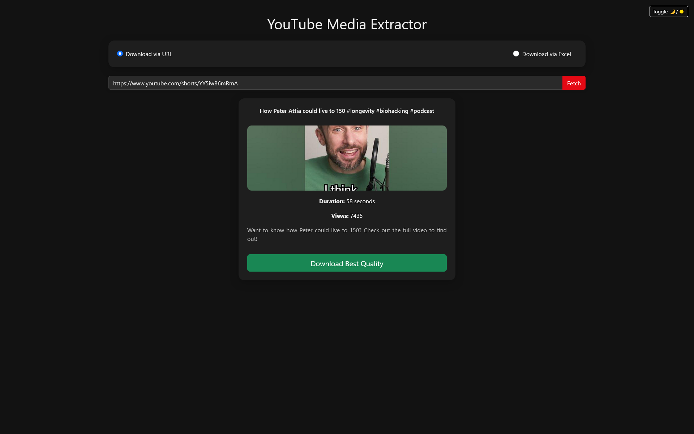
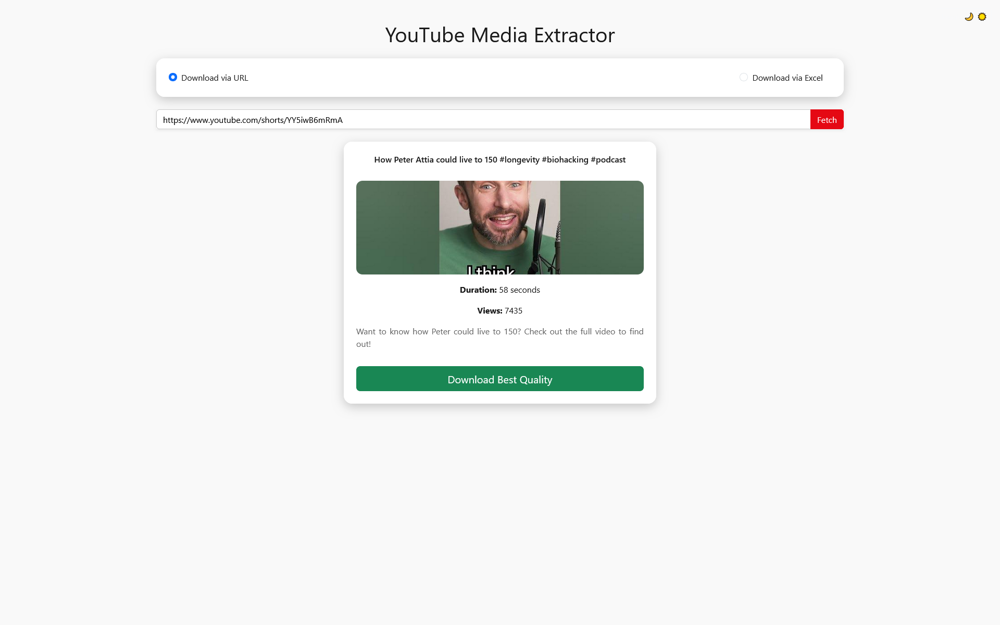
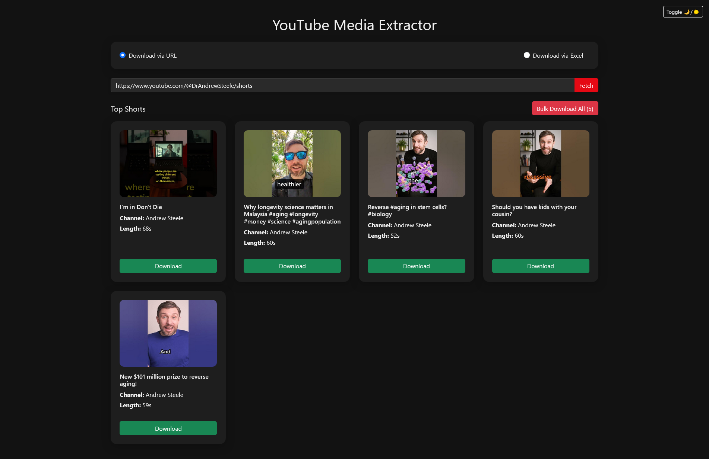
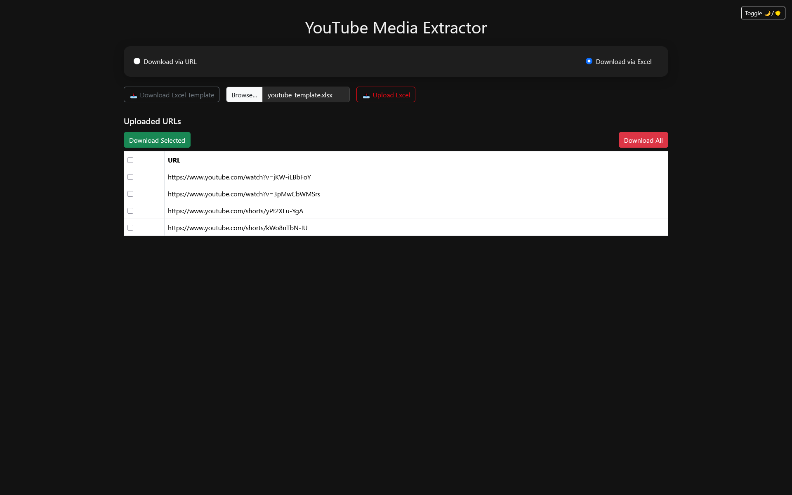

# YouTube Media Extractor

A sleek and simple web app built with **Flask** that allows users to fetch and download YouTube videos. Designed with a modern UI featuring responsive design and light/dark mode support.

---

## ✨ Features

- 📥 Download YouTube videos using `yt-dlp`
- 🎨 Beautiful light/dark theme with a toggle button
- 🧊 Glassmorphism-styled cards and smooth transitions
- 📸 Fixed-size thumbnails for a uniform layout

---

## 🖼️ Screenshots

| Light Mode | Dark Mode |
|------------|-----------|
|  |  |
|  |  |
|  | |


---

## 🛠 Tech Stack

- Backend: Python (Flask)
- Frontend: HTML + CSS (Custom, with light/dark theming)
- Tools: `yt-dlp`, `pandas`, `openpyxl`, `xlsxwriter`

---

## 📦 Installation

1. Clone the repository:
   ```bash
   git clone https://github.com/RasikhAli/YouTube-Media-Extractor.git
   cd youtube-downloader-app
   ```

2. Install dependencies:

   ```bash
   pip install -r requirements.txt
   ```

3. Run the application:

   ```bash
   python app.py
   ```

4. Visit `http://localhost:5000` in your browser.

---

## 📁 Project Structure

```
.
├── app.py
├── requirements.txt
├── static/
│   └── styles.css
├── templates/
│   └── index.html
├── screenshots/
│   ├── screen_1.png
│   ├── screen_2.png
│   ├── screen_3.png
│   ├── screen_4.png
│   └── screen_5.png
├── README.md
└── LICENSE
```

---

## 🔄 Light/Dark Mode

Use the toggle button in the top-right corner to switch between light and dark modes. Your preference is retained as you navigate.

---

## 📋 License

This project is licensed under the MIT License. See the [LICENSE](LICENSE) file for more details.

---

## 💡 Future Enhancements

* Add download progress feedback
* Drag and drop URL field
* Add mobile responsiveness tweaks

---

## 🤝 Contributions

Contributions, suggestions, and issues are welcome! Fork the repo, make changes, and submit a pull request.

---

If you like this project, consider giving it a ⭐ on GitHub!
